# PopHeroList
List of top 3 heroes based on their popularity.

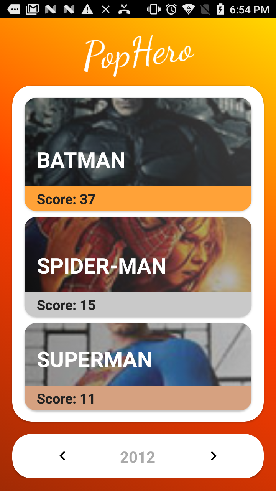

This is an app that is truly modular, with instrumentation/unit test in each module that test apply and doesn't have hardcoded parameters.

### [APK](base-hml-debug.apk)

## How it works

The app searches on the bitbucket api to discover which years are available inside the project repository. Then saves in memory the list of years and request the json through the bitbucket api as well.

### Architecture
This solution is kind overkill for this project, but I was hoping to show a good and scalable solution.

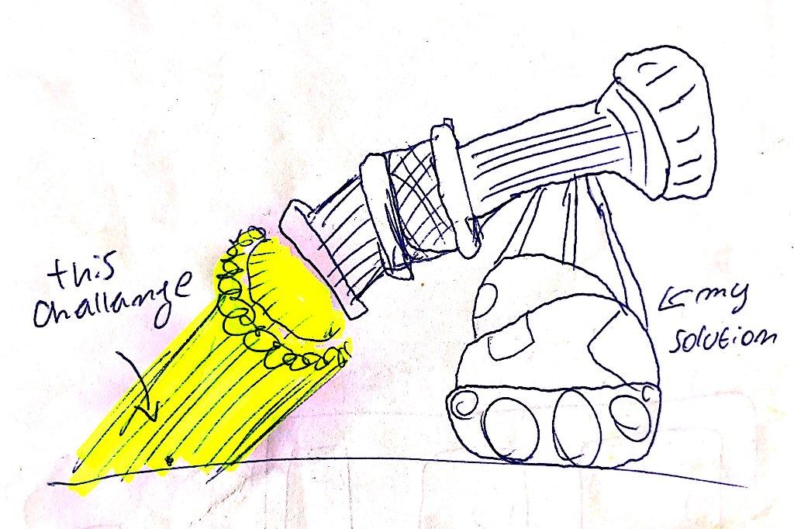

This app have multiple internal libraries that help build a more consistent architecture and also have modules (dynamic features) to isolate each feature as needed. This modular approach is great to large scale projects and teams due to it's easy of adding and deleting things.

#### - App Archtecture

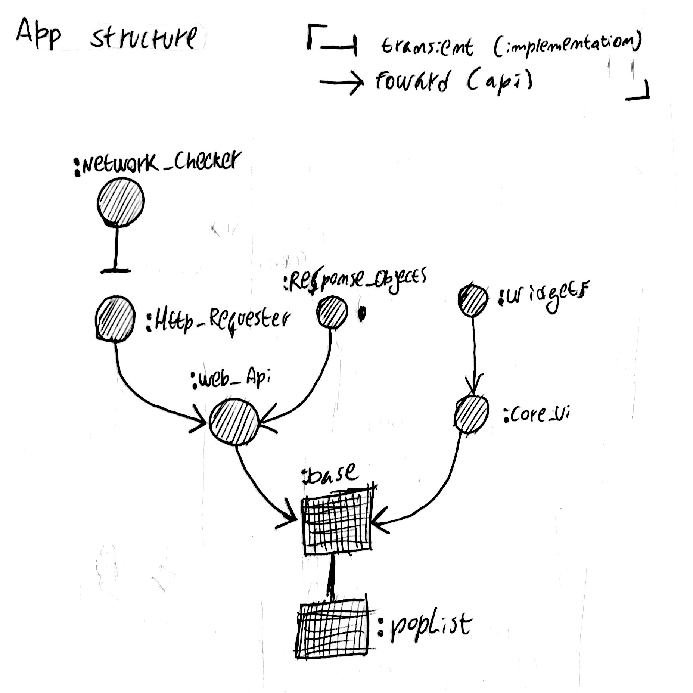

#### - Gradle scheme

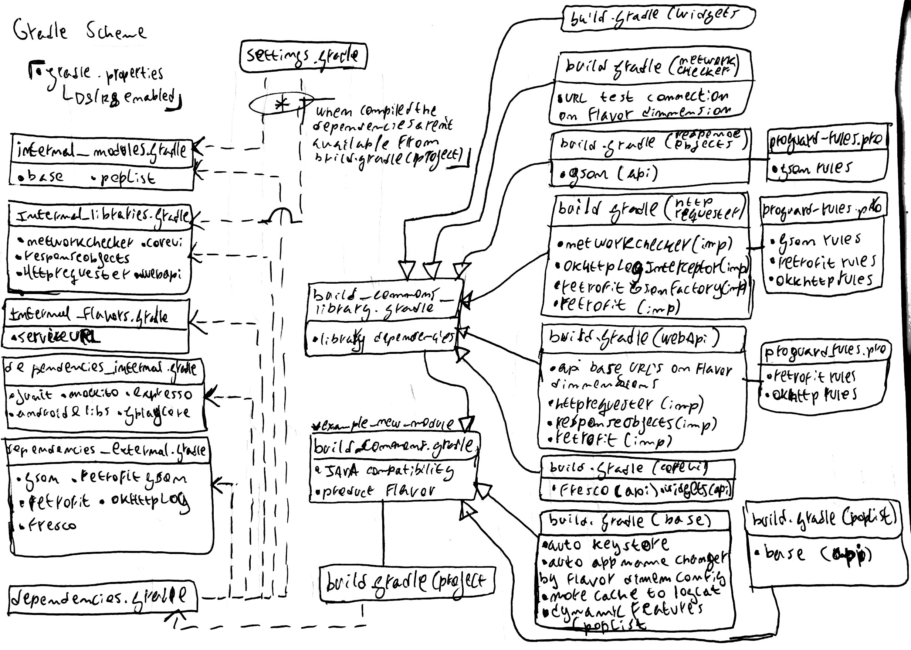

#### - NetworkChecker

Check if there really is internet connection reaching the device and also tell what kind of connection it has.

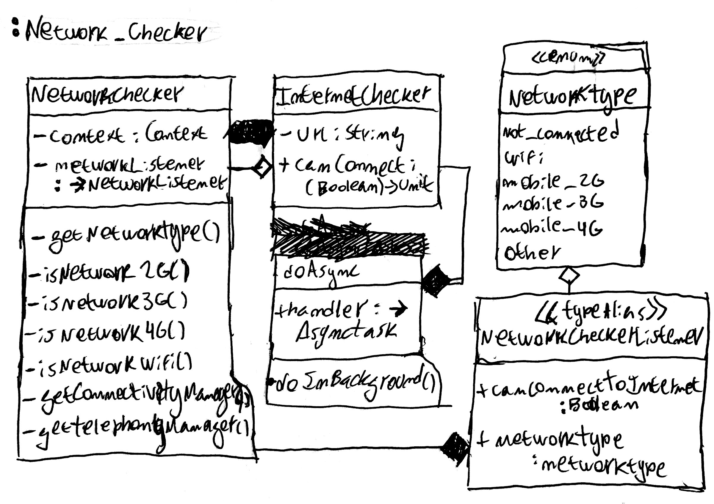

#### - HttpRequester

Layer of HTTP requests context free that works with generic types.

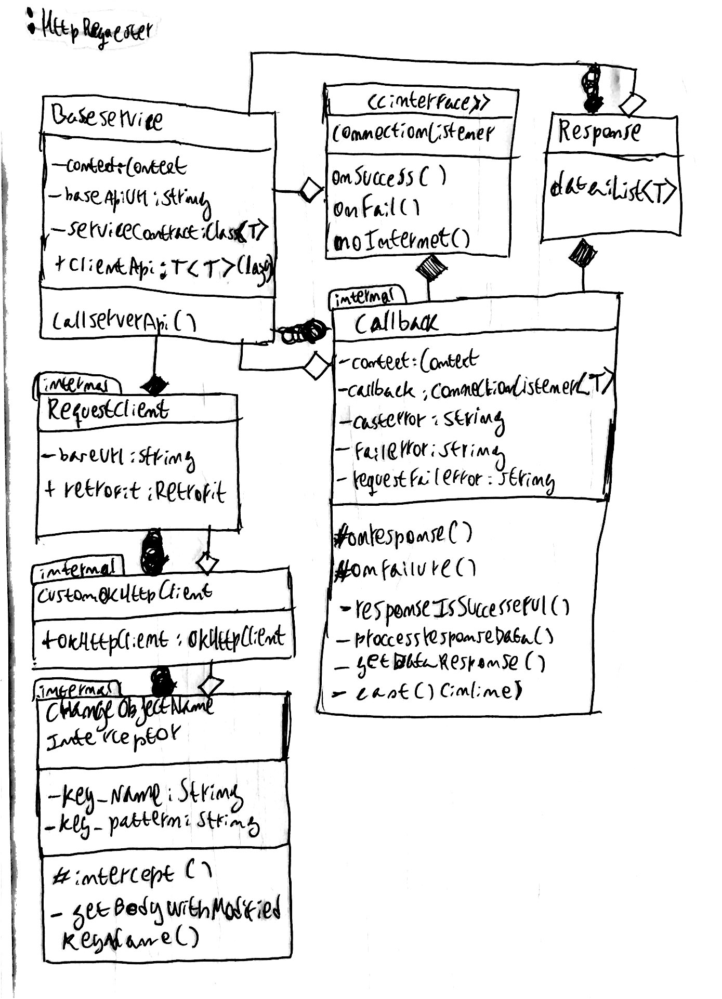

#### - WebApi

Layer to call services and filter (if needed) the server response.

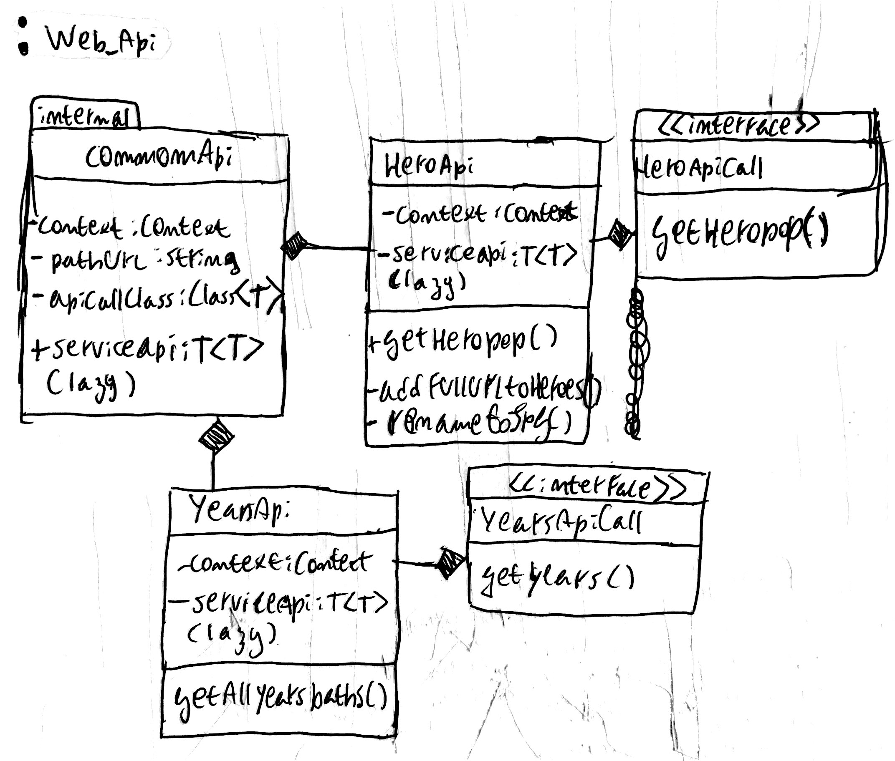

#### - ResponseObjects

All "pure" objects that is used in the API's.

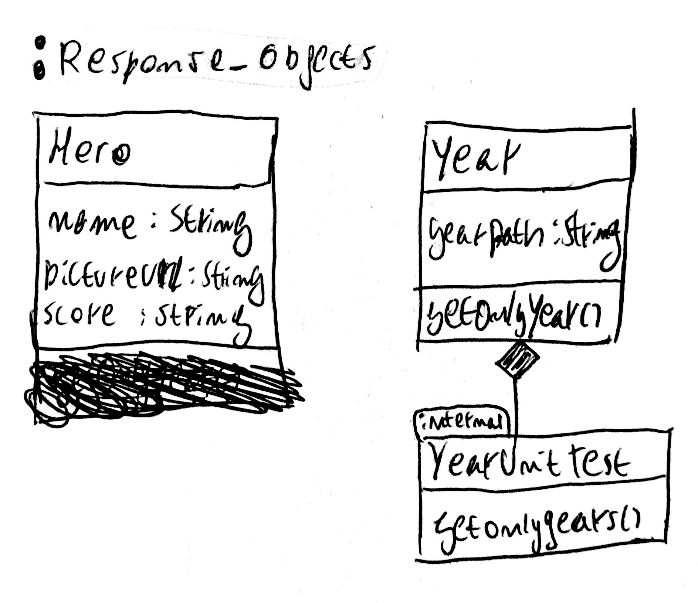 

#### - Widgets

Layer of custom Views context free.

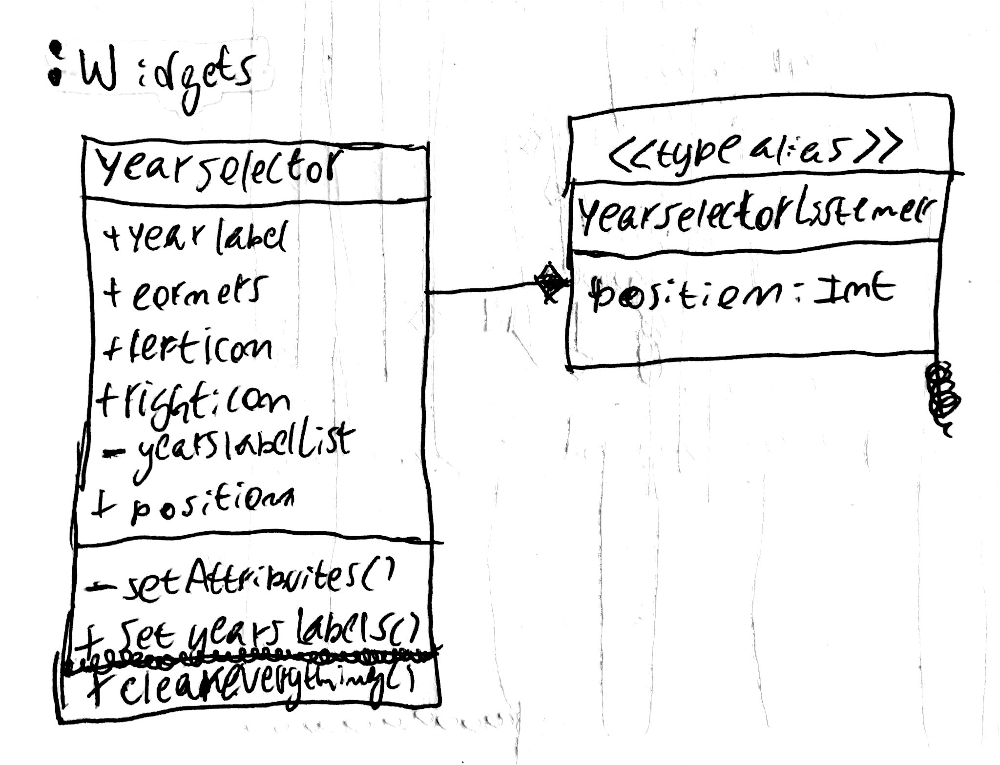

#### - CoreUI

Has all common resources, assets, styles, colours and so on.

(No classes to UML)

#### - Base

The base module that connects all the libraries above with the feature modules.

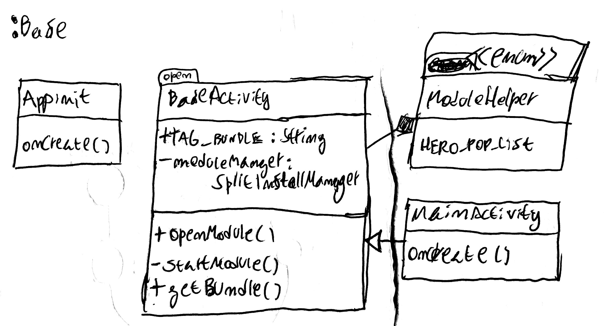

#### - PopList

Is the hero popularity feature module (dynamic module) that contains the logic to display the list of heroes.

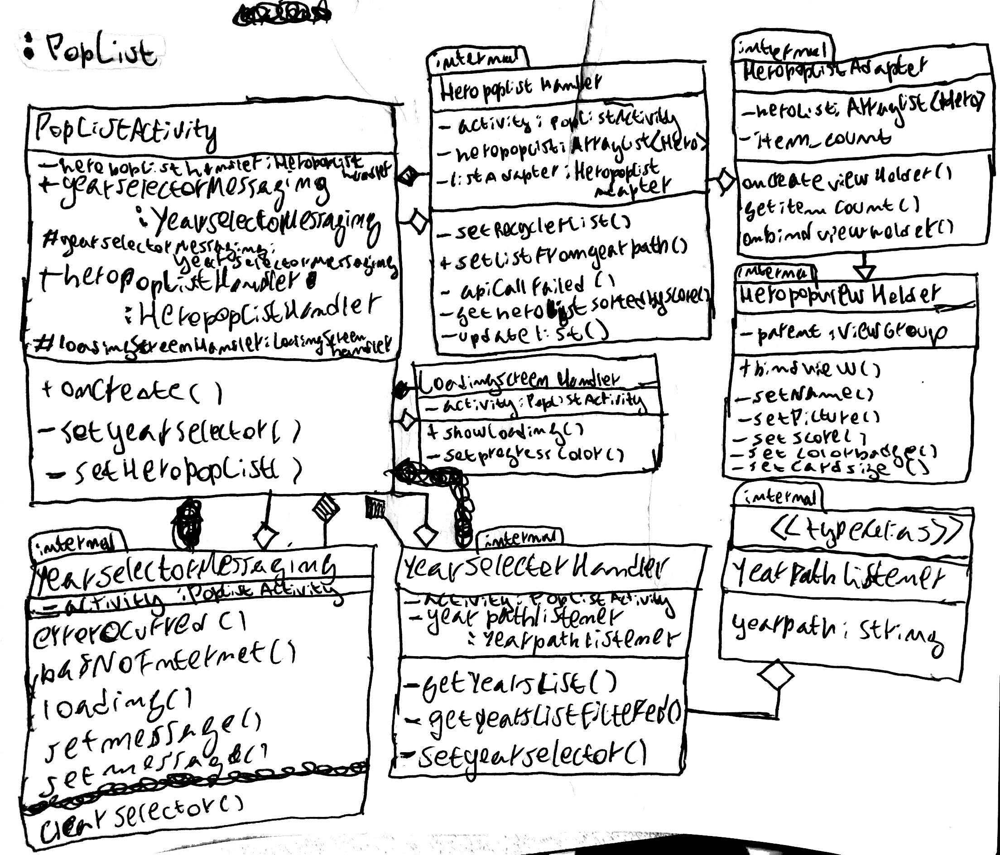

### Third party libraries

#### [Fresco](https://frescolib.org/)

This lib contains an excellent caching, memory managment for bitmaps and resizing. It's very easy to work with image download.

#### [Retrofit](https://square.github.io/retrofit/)

This lib has outstanding capabilities, due to it's easy of use, reliability and modularity. Can be bundled with the [Retrofit Gson Converter](https://github.com/square/retrofit/tree/master/retrofit-converters/gson) to automatic transform json to non annotated classes using [Gson](https://github.com/google/gson). Under the hood this library uses the [OkHttp](https://square.github.io/okhttp/), that is a very powerfull http dns basedlibrary.

#### [OkHttpLogInterceptor](https://github.com/square/okhttp/tree/master/okhttp-logging-interceptor)

An easy way to all API requests.

#### [Gson](https://github.com/google/gson)

Used on the ResponseObjects to add serialization annotation capabilities and the ability to transform any class/list into a Json without the need to add annotations to the class.
